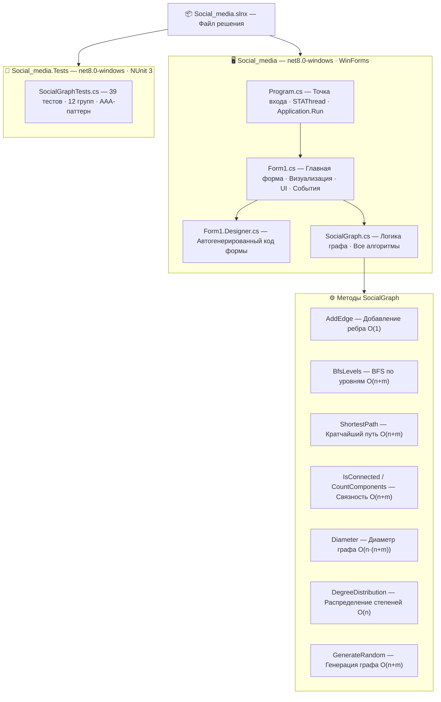

# Анализатор социальной сети

**Министерство науки и высшего образования Российской Федерации**
**Федеральное государственное бюджетное образовательное учреждение высшего образования**  
**«Тверской государственный технический университет» (ТвГТУ)**

**Курсовая работа**  
по дисциплине «Алгоритмизация и программирование»  
Тема: «Разработка приложений с графическим интерфейсом Windows Forms. Анализатор социальной сети»

**Выполнил:** студент 1 курса группы Б.ПИН.ИИ.25.16, Воронова Анфиса Сергеевна  
**Проверил:** Лисничук Арина Бахытжановна

г. Тверь

---

## 1. Аннотация программного продукта

Данный репозиторий содержит исходный код десктопного приложения, моделирующего граф социальной сети. Программный продукт разработан на платформе **.NET 8** с использованием языка программирования **C#** и технологии построения графического интерфейса **Windows Forms**.

Целью проекта является практическая реализация алгоритмов теории графов — обхода в ширину (BFS), поиска кратчайшего пути, анализа связности и вычисления диаметра — применительно к модели социальной сети. Все алгоритмы реализованы вручную без использования библиотечных аналогов.

---

## 2. Математическая модель

Социальная сеть представлена в виде **неориентированного графа** $G = (V, E)$, где:

- $V$ — множество вершин (пользователей), $|V| = n$
- $E$ — множество рёбер (дружеских связей), $|E| = m$

Граф хранится в виде **списка смежности** — массива `List<int>[]` размером $n$. Такое представление обеспечивает:

- Добавление ребра: $O(1)$ амортизированно
- Обход соседей вершины: $O(\deg(v))$
- Расход памяти: $O(n + m)$

### Ключевые характеристики графа

| Характеристика | Формула | Сложность |
|---|---|---|
| Степень вершины $v$ | $\deg(v) = \|N(v)\|$ | $O(1)$ |
| Среднее число друзей | $\bar{d} = \frac{2m}{n}$ | $O(n)$ |
| Диаметр графа | $D = \max_{u,v} d(u,v)$ | $O(n \cdot (n + m))$ |
| Число компонент | BFS из каждой непосещённой вершины | $O(n + m)$ |

### Генерация случайного графа

Граф генерируется в два этапа:

1. **Связный остов** — случайное остовное дерево методом Прима на случайной перестановке (алгоритм Фишера–Йейтса), гарантирующее связность.
2. **Дополнительные рёбра** — случайные пары вершин добавляются до достижения заданного числа рёбер.

---

## 3. Реализованные алгоритмы

### BFS по уровням (`BfsLevels`)

Обход в ширину от заданной вершины-источника до глубины `maxDepth`. Возвращает словарь `расстояние → список вершин`. Используется для визуализации «кругов общения» пользователя.

```
Сложность: O(n + m)
```

### Кратчайший путь (`ShortestPath`)

BFS с восстановлением пути через массив предшественников `prev[]`. Возвращает список вершин от источника до цели или пустой список при отсутствии пути.

```
Сложность: O(n + m)
```

### Связность и компоненты (`IsConnected`, `CountComponents`, `GetComponentIds`)

Полный BFS-обход графа с маркировкой посещённых вершин. Каждой вершине присваивается идентификатор компоненты.

```
Сложность: O(n + m)
```

### Диаметр графа (`Diameter`)

BFS из каждой вершины с отслеживанием максимального расстояния. Поддерживает отчёт о прогрессе через `IProgress<int>` для асинхронного вычисления в UI.

```
Сложность: O(n · (n + m))
```

### Распределение степеней (`DegreeDistribution`)

Подсчёт числа вершин для каждого значения степени. Результат отображается в виде гистограммы.

---

## 4. Структура проекта



---

## 5. Графический интерфейс

Приложение содержит четыре вкладки:

| Вкладка | Содержимое |
|---|---|
| **Граф** | Интерактивная визуализация графа с цветовой кодировкой по степени вершины. Клик по узлу показывает информацию о пользователе. |
| **Статистика** | Среднее, медиана, минимум и максимум степеней; число компонент; диаметр (асинхронное вычисление с прогресс-баром); гистограмма распределения степеней. |
| **BFS** | Обход в ширину от выбранного пользователя до заданной глубины с цветовой подсветкой уровней и легендой. |
| **Путь** | Поиск и визуализация кратчайшего пути между двумя пользователями с выделением рёбер пути. |

---

## 6. Модульное тестирование

Верификация алгоритмов проведена с использованием фреймворка **NUnit 3**. Тесты спроектированы по паттерну **AAA (Arrange — Act — Assert)** и сгруппированы по тестируемым методам.

### Покрытые сценарии (39 тестов)

| Группа | Тесты |
|---|---|
| Конструктор | Количество пользователей, имена, отсутствие рёбер |
| `AddEdge` | Двунаправленность, игнорирование петель и дублей, счётчик рёбер |
| `Degree` | Изолированный узел, узел с несколькими связями |
| `MostPopularUser` | Звёздный граф, граф из одного узла |
| `AverageDegree` | Пустой граф, путь, полный граф K3 |
| `DegreeDistribution` | Изолированные узлы, звёздный граф |
| `ShortestPath` | Один узел, соседи, длинный путь, нет пути |
| `BfsLevels` | Корректные уровни, ограничение глубины, изолированный источник |
| Связность | `IsConnected`, `CountComponents`, `GetComponentIds` |
| `Diameter` | Путь, звезда, одиночный узел |
| `BfsDistances` | Расстояние до источника, достижимые и недостижимые узлы |
| `GenerateRandom` | Количество узлов, связность, детерминированность по seed |

### Запуск тестов

```bash
dotnet test Social_media.Tests/Social_media.Tests.csproj
```

### Покрытие кода

```bash
# Сбор покрытия
dotnet test Social_media.Tests/Social_media.Tests.csproj --collect:"XPlat Code Coverage"

# Генерация HTML-отчёта (только класс SocialGraph, без форм)
reportgenerator -reports:"Social_media.Tests/TestResults/**/coverage.cobertura.xml" -targetdir:"coverage" -reporttypes:Html "-classfilters:+Social_media.SocialGraph"

# Открыть отчёт
start coverage\index.html
```

---

## 7. Инструкция по сборке и запуску

Для компиляции и запуска необходима платформа **.NET 8 SDK** и операционная система **Windows** (требование Windows Forms).

**Порядок запуска через Visual Studio:**

1. Клонировать репозиторий в локальную файловую систему.
2. Открыть файл решения `Social_media.slnx` в Visual Studio 2022.
3. Установить проект `Social_media` в качестве загружаемого по умолчанию.
4. Выполнить сборку решения (`F6`).
5. Запустить приложение (`F5`).

**Порядок запуска через терминал:**

```bash
git clone <url>
cd Social_media
dotnet run --project Social_media/Social_media.csproj
```

**Запуск тестов:**

```bash
dotnet test Social_media.Tests/Social_media.Tests.csproj
```

### Системные требования

- .NET 8 SDK или выше
- Windows 10/11 (для работы Windows Forms)
- Visual Studio 2022 (рекомендуется) или любой редактор с поддержкой .NET
